## Survey on the satisfaction of majoring geography to Daxia platform
**1 The questionnaire**  
#### &nbsp;&nbsp;&nbsp;&nbsp;The object we surveyed is the students majoring geography. We have collected 32 questionnaires and only 30 of them are valuable, because two are not majoring in geography.There are 4 males and 26 females, and we can see most of them are senior,Whic is helpful for the research, because senior students have used daxia platform many times.

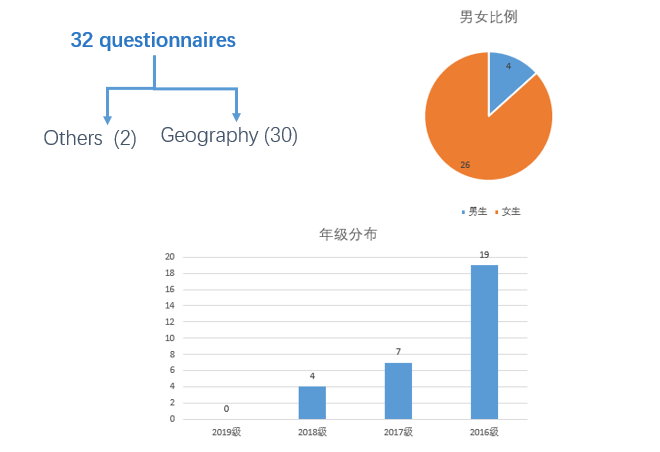

>**2 Confidence_Intervals Sheet**   

#### &nbsp;&nbsp;&nbsp;&nbsp;When the Confidence level is equal to 95%, the corresponding Z value is 1.96. The calculation formula of standard error is SE=(Std.Dev.)/√N ，Confidence is equal to SE\*1.96, and Confidence interval is equal to mean-confidence to Mean+Confidence.

#### &nbsp;&nbsp;&nbsp;&nbsp;For example, in Item1 of the first line of Confidence_Intervals Sheet, if the confidence level is equal to 95%, the corresponding Z value is 1.96, the calculation formula of standard error is SE=1.472/√30=0.269 , SE\*1.96=0.527, and the corresponding confidence interval is 0.273\~1.327. It indicates that when there is another sample, there is a 95% probability of appearing in the range 0.273\~1.327.

>**3 Answer_Distributions Sheet** 

#### &nbsp;&nbsp;&nbsp;&nbsp;In Answer_Distributions Sheet, mostly in 4 or 5 points, in the slow / fast, not interesting / interesting, boring / exciting aspect, the number of negative evaluation is more.

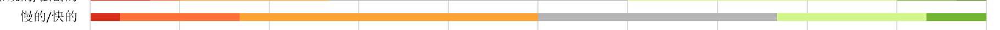

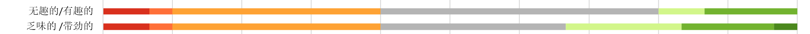

#### &nbsp;&nbsp;&nbsp;&nbsp;Similarly, the number of people who made positive evaluations was higher in areas that were impractical / practical, obstructive / supportive, inferior / valuable.

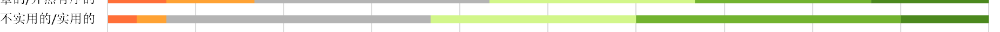

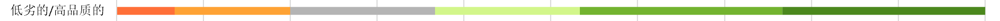

#### &nbsp;&nbsp;&nbsp;&nbsp;It can be seen that the user experience of daxia school is not very good, but it can provide help for learning in terms of functionality. If more attention is paid to user experience, daxia school will be more perfect.

>**4 Inconsistencies**
#### &nbsp;&nbsp;&nbsp;&nbsp;In Inconsistencies sheet, the detect Suspicious Data can detect such more or less random or not serious answers because not all participants will answer all items seriously. In a participant's questionnaire, in the same dimension, if the best evaluation minus the worst evaluation score is higher than 3, it means that the participant's answer in this dimension is not serious.
#### &nbsp;&nbsp;&nbsp;&nbsp;In our questionnaire data, one person did not answer seriously in three dimensions. Three people did not answer seriously in two dimensions. It is indicated that most of the participants were very serious about this questionnaire.

>**5 Sample_size**
#### &nbsp;&nbsp;&nbsp;&nbsp;The Sample_size sheet can give the minimum sample number of our questionnaire under certain precision and confidence interval according to the standard deviation. The precision refers to the deviation between true scale mean in the population and the estimated scale mean from the sample. The confidence interval refers to interval estimate of a population parameter and is used to indicate the reliability of an estimate. The standard deviation refers to the square root of the variance.
#### &nbsp;&nbsp;&nbsp;&nbsp;Our sample size is 30, and confidence interval is calculated to be 95%. The precision is 0.5.
#### &nbsp;&nbsp;&nbsp;&nbsp;The value in the population is the value from the sample plus or minus 0.5, and we have a 95% probability that the true value in the population is within this interval.

>**6 Scale_Consistency**
#### &nbsp;&nbsp;&nbsp;&nbsp;Judgment criteria: there is no unified standard to determine how big the value of the reliability coefficient should be. However, it is generally believed that if the reliability coefficient is above 0.9, the reliability is very well. The reliability coefficient is acceptable at 0.8-0.9. At 0.7-0.8, the scale does not lose its value. But if the coefficient below 0.7 indicates a change.  
#### &nbsp;&nbsp;&nbsp;&nbsp;In this analysis, the scale was judged to have reliability based on the alpha value greater than 0.7.  
#### &nbsp;&nbsp;&nbsp;&nbsp;Alpha coefficient and Guttmans Lambda2 coefficient can both be used to measure the reliability of the scale, and there is little difference in this analysis. In the six dimensions, the two coefficients above 0.9 of attractiveness indicate that the attractiveness scale has a high reliability. The alpha and lambda2 values of efficiency, dependability, stimulation and novelty are all above 0.8, which proves that the problems in a single dimension are highly reliability. However, the Perspicuity alpha value is 0.61, which indicates that it does not meet the criteria of the reliability of the scale and needs to be modified.  

>**7 Benchmark**  
#### &nbsp;&nbsp;&nbsp;&nbsp;In the chart, we can see data from 18,483 people studied in 401 studies concerning different products (business software, web pages, online stores, social networks). It can be used as a benchmark and compared with the questionnaire data, and then the grade of daxia school relative to other products can be obtained.  
#### &nbsp;&nbsp;&nbsp;&nbsp;It can be seen from the mean line of the reference graph that all the six dimensions of daxia school are all at the bottom, and there is a big gap with other products. In addition, attractiveness, efficiency, dependability, stimulation and novelty are all in the last layer of the five levels, while Perspicuity is on the penultimate level. It can be seen that daxia school still has considerable space for improvement in these six dimensions.

>**8 Main result**  
####  &nbsp;&nbsp;&nbsp;&nbsp; As we can see from following table1, mean value of 6 scales are all between 0.8 and -0,8. the highest is perspicuity whose mean value is 0.75(SD=0.98), the lowest are the scale of stimulation and novelty, the mean value of which are both 0.133. thus, we can have a result that users experience of daxia platform from gis (geographic information science) students are neural and modest.

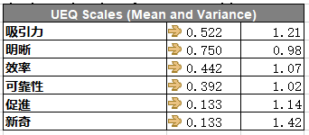

####  &nbsp;&nbsp;&nbsp;&nbsp; As it shown in following figure1, we can have a visualized and intuitive description of users experience. But we can’t see the detailed mean value and standard deviation of each scale if we ignore the table1. 

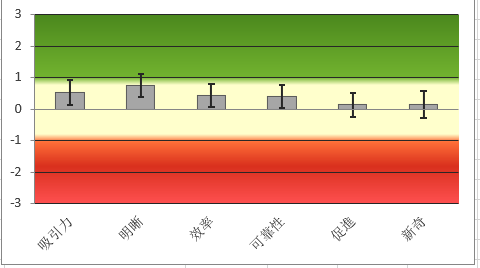

####  &nbsp;&nbsp;&nbsp;&nbsp; Let us move into more detailed descriptions of each item.（figure3） Obviously, this figure can give us more direct and clear explanation that why the mean value of 6 scales are below 0.8. for example, the mean value of novelty scale is 0.133. the result is mainly due to users experience of daxia platform are dull, conventional, traditional and conservative.  Thus, this result can give some suggestion for developers and designers to think about how to improve novelty of daxia platform from different items.

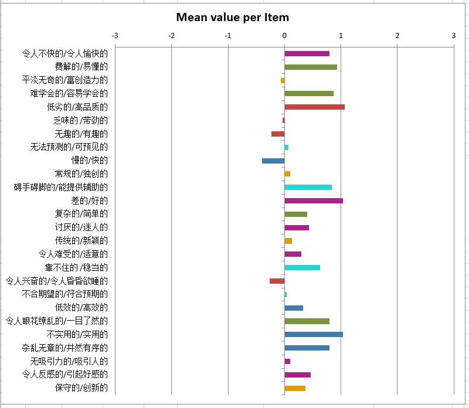 

####  &nbsp;&nbsp;&nbsp;&nbsp; The table2 is a statistical description of pragmatic and hedonic quality of daxia platform. The results showed that attractiveness and pragmatic are neural(between -0.8, 0.8), while, the quality of hedonic is lower than pragmatic and attractiveness. That means users thought that daxia platform are less attractive and practical, not to mention its hedonic quality. 

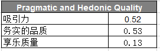

**9 Conclusion**  
#### &nbsp;&nbsp;&nbsp;&nbsp;The last question is do you want to use daxia platform?the full score is ten, but the research showed it was only 4.1, students majoring geography are unwilling to use it.So,in summary, our team think daxia platform has a full function, but a bad user experience.And if more attention is paid to user experience, Daxia  will be more perfect!

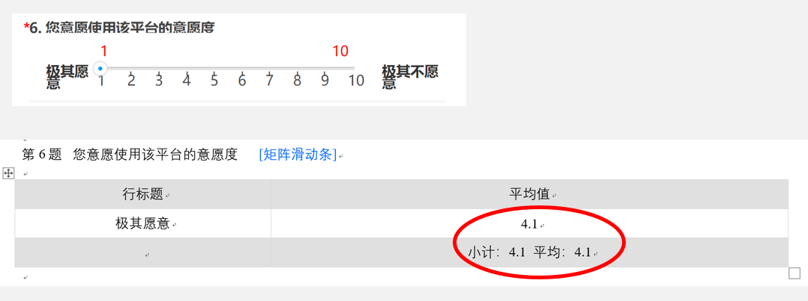

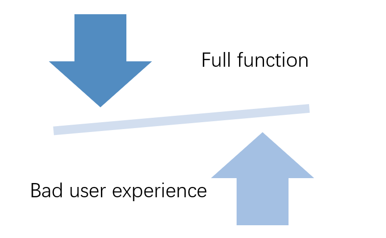

