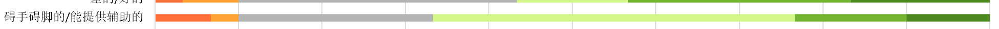

## Survey on the satisfaction of majoring geography to Daxia platform

>**2 Confidence_Intervals Sheet**   

#### &nbsp;&nbsp;&nbsp;&nbsp;When the Confidence level is equal to 95%, the corresponding Z value is 1.96. The calculation formula of standard error is SE=(Std.Dev.)/√N ，Confidence is equal to SE\*1.96, and Confidence interval is equal to mean-confidence to Mean+Confidence.

#### &nbsp;&nbsp;&nbsp;&nbsp;For example, in Item1 of the first line of Confidence_Intervals Sheet, if the confidence level is equal to 95%, the corresponding Z value is 1.96, the calculation formula of standard error is SE=1.472/√30=0.269 , SE\*1.96=0.527, and the corresponding confidence interval is 0.273\~1.327. It indicates that when there is another sample, there is a 95% probability of appearing in the range 0.273\~1.327.

>**3 Answer_Distributions Sheet** 

#### &nbsp;&nbsp;&nbsp;&nbsp;In Answer_Distributions Sheet, mostly in 4 or 5 points, in the slow / fast, not interesting / interesting, boring / exciting aspect, the number of negative evaluation is more.

#### &nbsp;&nbsp;&nbsp;&nbsp;Similarly, the number of people who made positive evaluations was higher in areas that were impractical / practical, obstructive / supportive, inferior / valuable.

#### &nbsp;&nbsp;&nbsp;&nbsp;It can be seen that the user experience of daxia school is not very good, but it can provide help for learning in terms of functionality. If more attention is paid to user experience, daxia school will be more perfect.

>**4 Inconsistencies**
#### &nbsp;&nbsp;&nbsp;&nbsp;In Inconsistencies sheet, the detect Suspicious Data can detect such more or less random or not serious answers because not all participants will answer all items seriously. In a participant's questionnaire, in the same dimension, if the best evaluation minus the worst evaluation score is higher than 3, it means that the participant's answer in this dimension is not serious.
#### &nbsp;&nbsp;&nbsp;&nbsp;In our questionnaire data, one person did not answer seriously in three dimensions. Three people did not answer seriously in two dimensions. It is indicated that most of the participants were very serious about this questionnaire.

>**5 Sample_size**
#### &nbsp;&nbsp;&nbsp;&nbsp;The Sample_size sheet can give the minimum sample number of our questionnaire under certain precision and confidence interval according to the standard deviation. 

